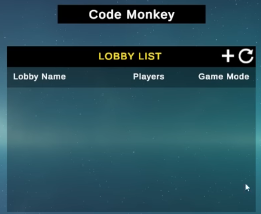
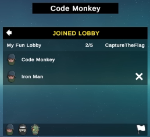
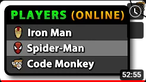
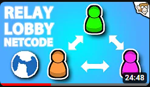

# Create Lobby and Relay, work with Netcode for a Multiplayer game
Link tutorial: <a href="https://www.youtube.com/watch?v=-KDlEBfCBiU">Lobby</a> 

Link tutorial: <a href="https://www.youtube.com/watch?v=msPNJ2cxWfw">Relay</a> 

