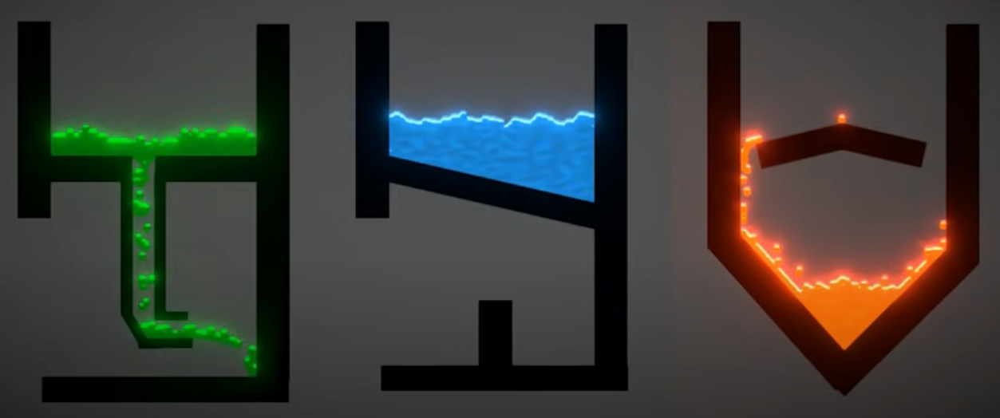

Simulation liquid:

<ul>
  <li>Each particle is a game object (cost performance).
  <li>Render them on a RenderTexture with custom shader to look like liquid.
  <li>But it still looks dense and physics be not good enough.
</ul>

Link tut: <a href="https://www.youtube.com/watch?v=_8v4DRhHu2g">Code Monkey</a>

