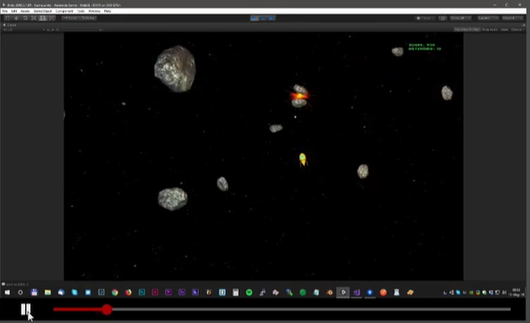

Để tạo 1 MediaPlayer:

<ul>
<li>Component VideoPlayer</li>
<li>Tạo 1 RenderTexture để phát video lên đó</li>
<li>Tạo 1 obj 3D, gắn RenderTexture làm material cho nó (shader của 3D: Texture)</li>
</ul>

 
<a href="https://oxmond.com/how-to-build-a-video-player-with-scrub-control-in-unity/">Link Unity package</a>
